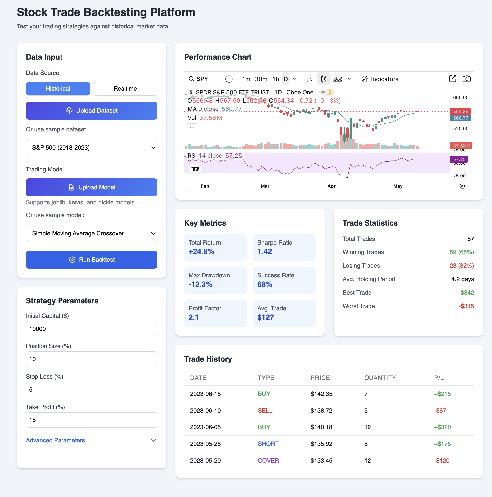

# Stock Trade Backtesting Platform (Demo Design)

A web-based platform for backtesting stock trading strategies using historical and real-time market data. Built with Django, Django REST Framework, and Tailwind CSS.

## Features

- Upload datasets (CSV, JSON, XLSX) or use sample datasets (S&P 500, NASDAQ, etc.).
- Support for ML trading models (joblib, keras, pickle).
- Real-time data feed simlation and interactive performance charts with TradingView (previously Chart.js).
- Detailed trade history and key metrics.

## Example


## Prerequisites

- Python 3.9+
- Docker and Docker Compose
- Node.js (optional for frontend development)

## Setup

1. **Clone the repository**:

   ```bash
   git clone https://github.com/maxhe5919/backtesting.git
   cd backtesting
   ```

2. **Set up environment variables**: Create `.env` in the project root:

   ```bash
   echo "DJANGO_SECRET_KEY=$(python -c 'import secrets; print(secrets.token_urlsafe(50))')" > .env
   echo "DEBUG=True" >> .env
   echo "DB_NAME=backtesting_db" >> .env
   echo "DB_USER=super_max" >> .env
   echo "DB_PASSWORD=your_secure_password" >> .env
   echo "DB_HOST=db" >> .env
   echo "DB_PORT=5432" >> .env
   ```

3. **Install Python dependencies** (optional, if not using Docker):

   ```bash
   python -m venv .venv
   source .venv/bin/activate
   pip install -r backend/requirements.txt
   ```

4. **Build and run with Docker**:

   ```bash
   docker-compose build --no-cache
   docker-compose up
   ```

5. **Run migrations**:

   ```bash
   docker-compose exec web python backend/manage.py makemigrations
   docker-compose exec web python backend/manage.py migrate
   ```

6. **Create a superuser**:

   ```bash
   docker-compose exec web python backend/manage.py createsuperuser
   ```

7. **Access the application**: Open `http://localhost:8000` in your browser. The admin interface is at `http://localhost:8000/admin`.

## Development

- **Backend**: Located in `backend/`. Uses Django and Django REST Framework.
- **Frontend**: Located in `frontend/`. Uses Django templates, Tailwind CSS, and vanilla JavaScript with TradingView charts.
- **Static files**: Run `python backend/manage.py collectstatic` to collect static files.
- **Database**: PostgreSQL runs in a Docker container. Data is persisted in the `postgres_data` volume.

## Security

- CSRF protection enabled.
- API authentication with token-based authentication.
- Sensitive data stored in `.env`.

## Contributions

This page is designed using Canva AI.

## License

This project is licensed under the MIT License. See the LICENSE file for details.
